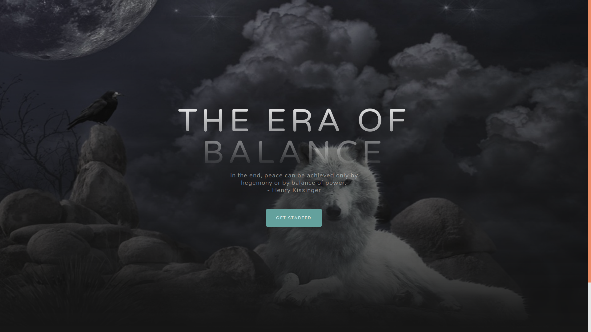
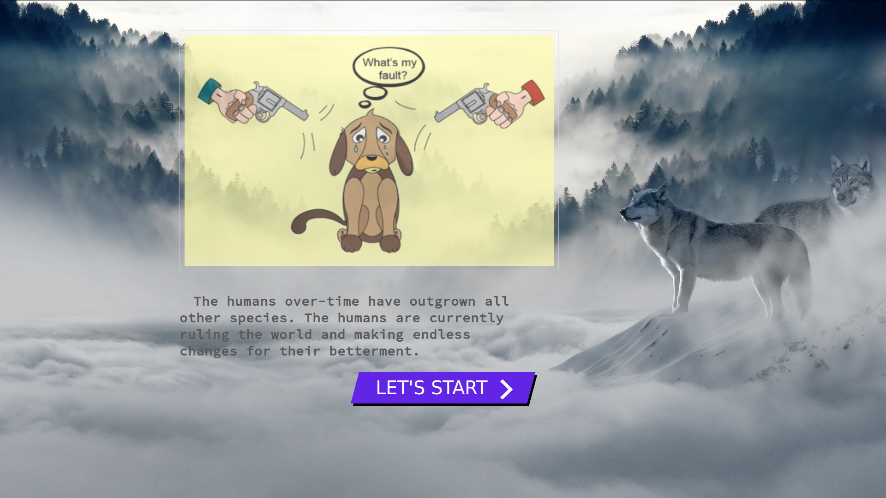
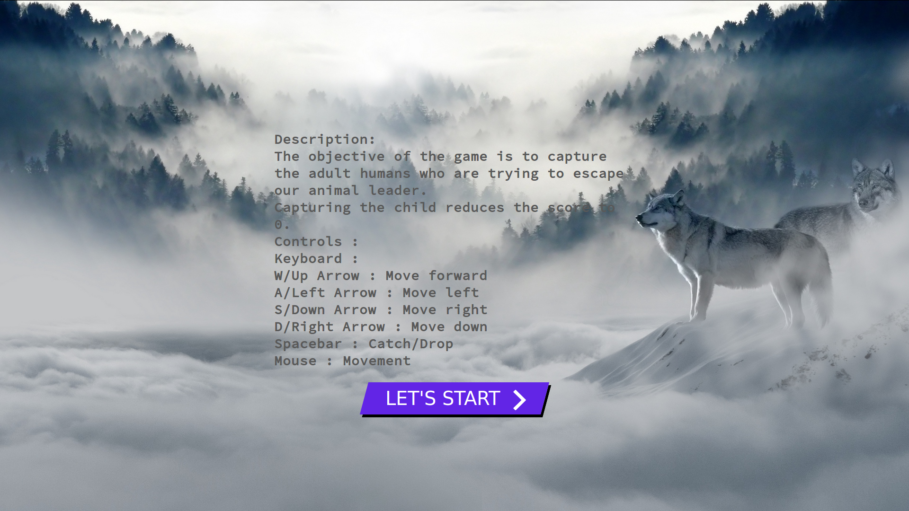
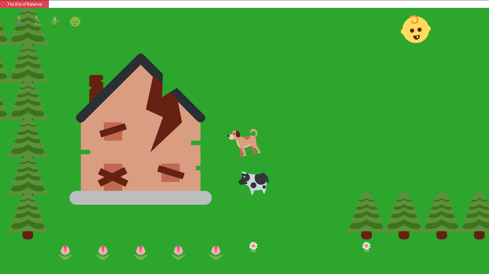
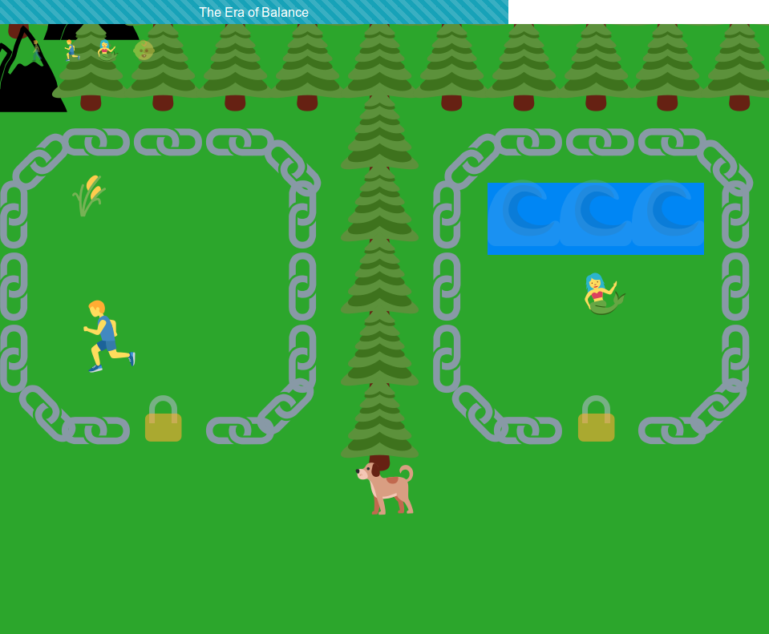
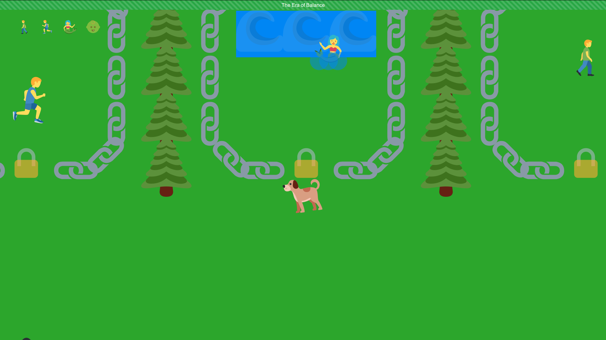
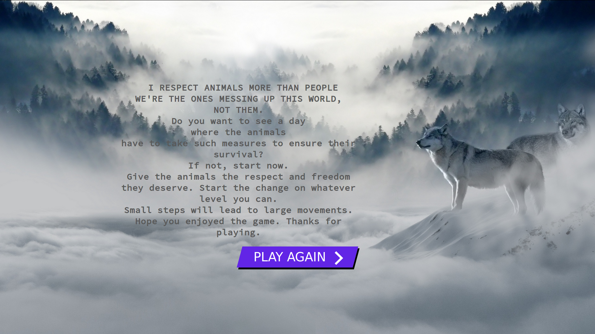

# The Era Of Balance

### Story:
* **The humans over-time have outgrown  all other species**. The humans are currently ruling the world and making endless changes for their betterment.
* Animals have decided to fight their dominance and rebel against the humans to restore the balance of power.
* Help our current animal leader in **capturing its human captors** and **restoring the balance of power**.  

### Description:

**The objective of the game is to capture the adult humans who are trying to escape our animal leader.**   

**Game Concept** - Balance in environment ensures survival. The game deals with how the animals rebel against the humans to restore the balance when the **humans grow into the dominant species**.  
**Genre** - Action, Strategy  
**Target Audience** - Kids(for educational purposes), Animal welfare organisations.  

**Capturing the child reduces the score to 0.**

### Usage :

To start the game   

> <browser> index.html

### Controls : 

Keyboard :  

**W**/**Up Arrow** : Move forward  
**A**/**Left Arrow** : Move left  
**S**/**Down Arrow** : Move right  
**D**/**Right Arrow** : Move down  
**Spacebar** : Drop  

**Mouse** : Movement  

### Screenshots

### Authors

**Yudhik Agrawal** : 20161093

**Anvesh Chaturvedi** : 20161094